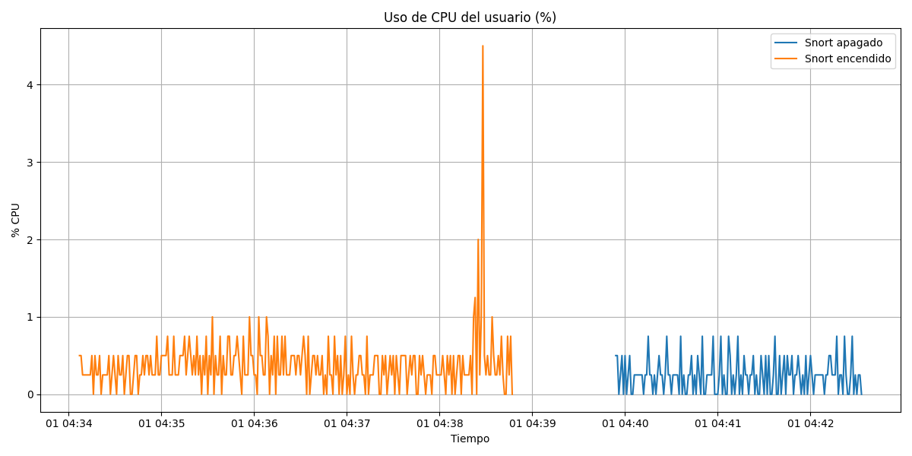
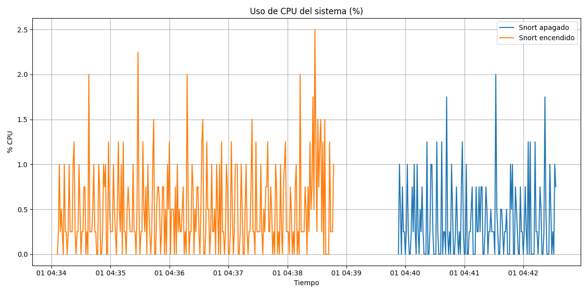
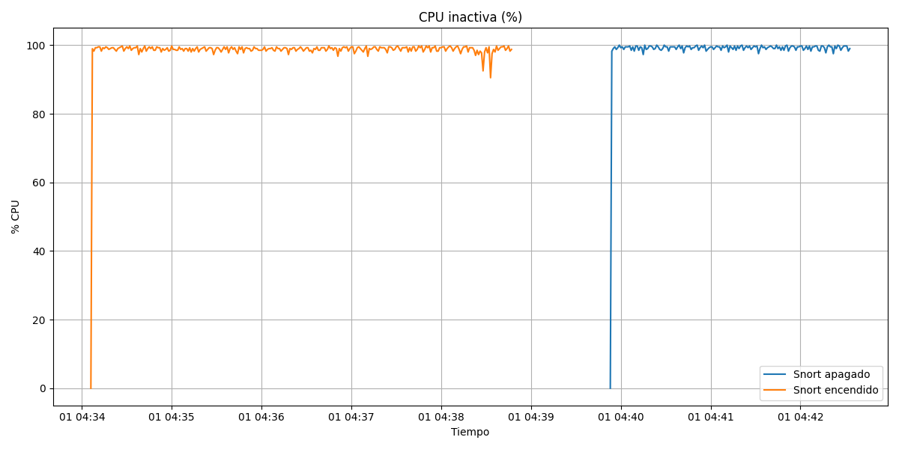
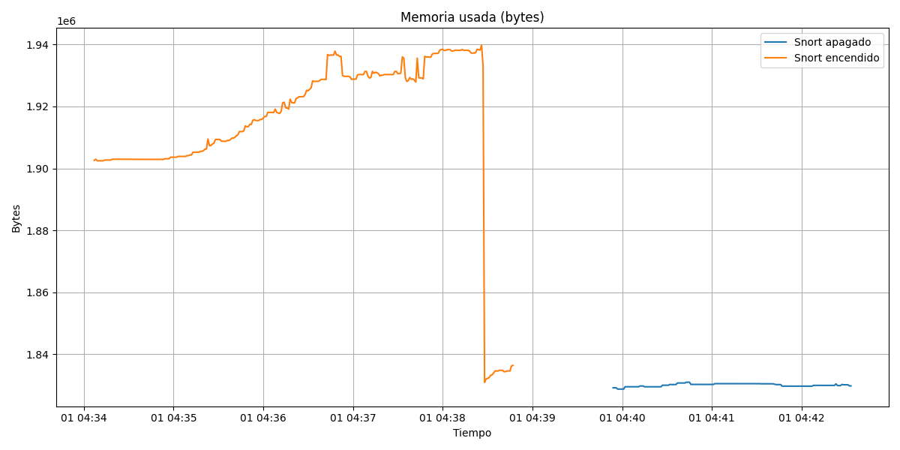
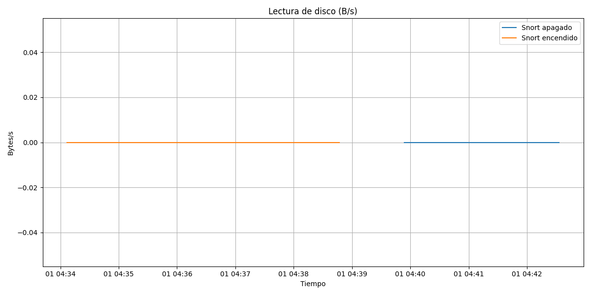
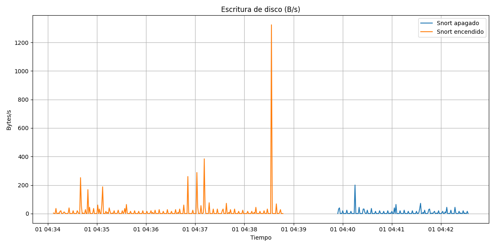
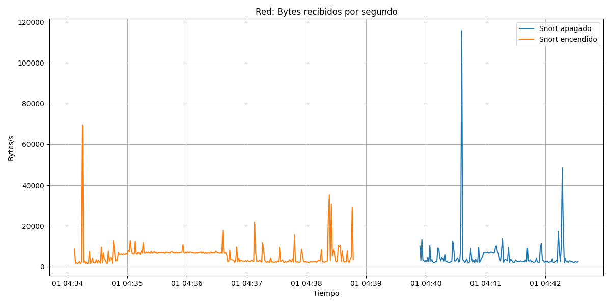
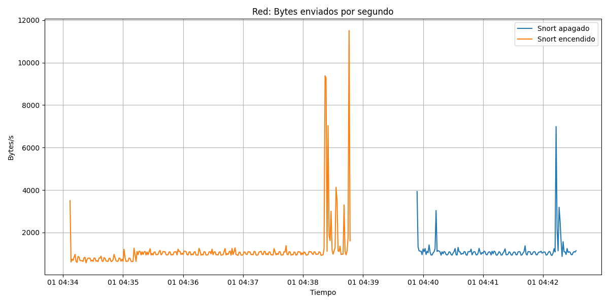
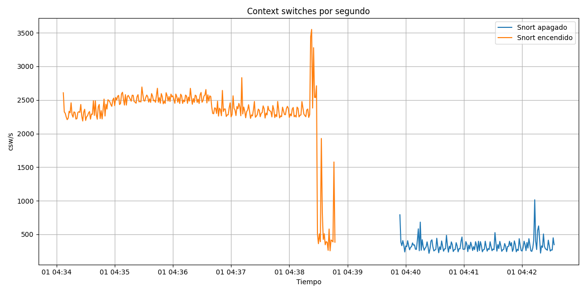

# Informe de rendimiento de R-Snort

Este informe compara métricas de sistema con Snort encendido y apagado, usando los datos de `dstat`.

## Uso de CPU del usuario (%)

**% CPU.**

## Uso de CPU del sistema (%)

**% CPU.**

## CPU inactiva (%)

**% CPU.**

## Memoria usada (bytes)

**Bytes.**

## Lectura de disco (B/s)

**Bytes/s.**

## Escritura de disco (B/s)

**Bytes/s.**

## Red: Bytes recibidos por segundo

**Bytes/s.**

## Red: Bytes enviados por segundo

**Bytes/s.**

## Context switches por segundo

**csw/s.**

